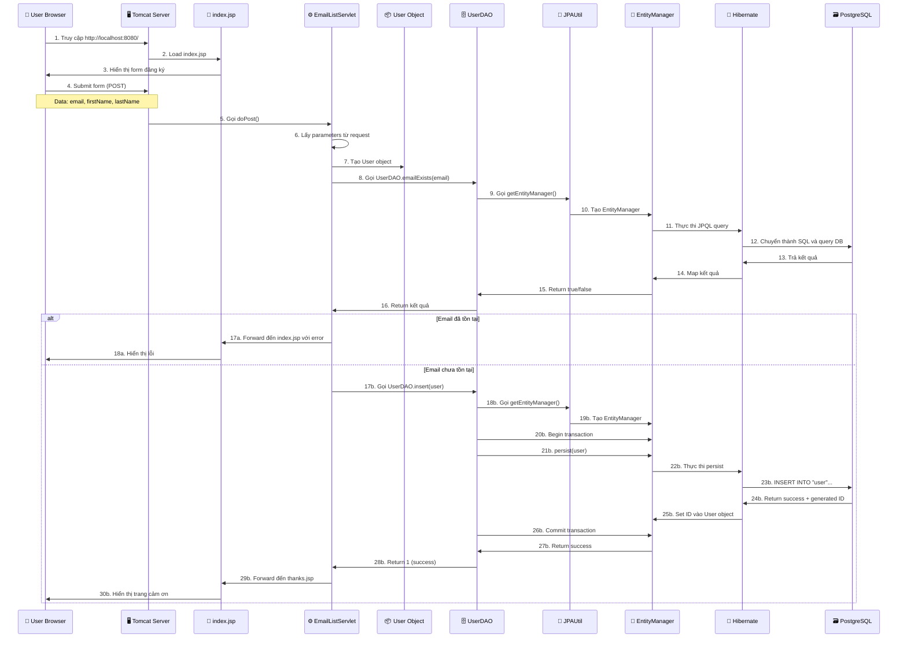

# Luồng Code Chạy - SQLGatewayApp với JPA

## 📋 Tổng quan

Tài liệu này giải thích **chi tiết từng bước** code chạy như thế nào, từ khi user truy cập website đến khi dữ liệu được lưu vào database.

---

## 🎯 Kịch bản: User đăng ký email

Giả sử user muốn đăng ký email với thông tin:
- Email: `john@example.com`
- First Name: `John`
- Last Name: `Doe`

---

## 🔄 Luồng hoàn chỉnh (Flow Diagram)



---

## 📝 Chi tiết từng bước

### **BƯỚC 1-3: User truy cập trang web**

#### Bước 1: User mở browser
```
User nhập: http://localhost:8080/
```

#### Bước 2: Tomcat xử lý request
```
Tomcat nhận request → Tìm file index.jsp
```

#### Bước 3: Hiển thị form
**File**: `index.jsp` (dòng 26-39)

```jsp
<form action="emailList" method="post">
    <input type="hidden" name="action" value="add">
    
    <label>Email Address</label>
    <input type="email" name="email" required>
    
    <label>First Name</label>
    <input type="text" name="firstName" required>
    
    <label>Last Name</label>
    <input type="text" name="lastName" required>
    
    <input type="submit" value="Subscribe">
</form>
```

**User thấy**: Form với 3 ô input và nút Subscribe

---

### **BƯỚC 4: User submit form**

User điền:
- Email: `john@example.com`
- First Name: `John`
- Last Name: `Doe`

Nhấn nút **Subscribe**

**HTTP Request được gửi**:
```http
POST /emailList HTTP/1.1
Host: localhost:8080
Content-Type: application/x-www-form-urlencoded

action=add&email=john@example.com&firstName=John&lastName=Doe
```

---

### **BƯỚC 5-7: Servlet xử lý request**

#### Bước 5: Tomcat gọi EmailListServlet
**File**: `EmailListServlet.java`

Tomcat tìm servlet mapping cho `/emailList` và gọi method `doPost()`

#### Bước 6: Lấy parameters
**File**: `EmailListServlet.java` (dòng 36-39)

```java
protected void doPost(HttpServletRequest request,
                     HttpServletResponse response) {
    // Lấy action
    String action = request.getParameter("action"); // "add"
    
    // Lấy dữ liệu từ form
    String firstName = request.getParameter("firstName"); // "John"
    String lastName = request.getParameter("lastName");   // "Doe"
    String email = request.getParameter("email");         // "john@example.com"
```

#### Bước 7: Tạo User object
**File**: `EmailListServlet.java` (dòng 42)

```java
// Tạo User object
User user = new User(firstName, lastName, email);
```

**Trong bộ nhớ**:
```
user = {
    userId: null,           // Chưa có ID (chưa lưu DB)
    firstName: "John",
    lastName: "Doe",
    email: "john@example.com"
}
```

---

### **BƯỚC 8-16: Kiểm tra email tồn tại**

#### Bước 8: Gọi UserDAO.emailExists()
**File**: `EmailListServlet.java` (dòng 46)

```java
if (UserDAO.emailExists(user.getEmail())) {
    // Email đã tồn tại
}
```

#### Bước 9: UserDAO gọi JPAUtil
**File**: `UserDAO.java` (dòng 122-124)

```java
public static boolean emailExists(String email) {
    EntityManager em = null;
    
    try {
        em = JPAUtil.getEntityManager(); // ← Bước 9
```

#### Bước 10: JPAUtil tạo EntityManager
**File**: `JPAUtil.java` (dòng 22-26)

```java
public static EntityManager getEntityManager() {
    if (emf == null) {
        throw new IllegalStateException("EntityManagerFactory is not initialized");
    }
    return emf.createEntityManager(); // ← Tạo EntityManager mới
}
```

**Trong bộ nhớ**:
```
EntityManager được tạo
  ↓
Kết nối đến persistence.xml
  ↓
Đọc cấu hình database connection
  ↓
Sẵn sàng thực thi queries
```

#### Bước 11: Thực thi JPQL query
**File**: `UserDAO.java` (dòng 127-130)

```java
TypedQuery<Long> query = em.createQuery(
    "SELECT COUNT(u) FROM User u WHERE u.email = :email", 
    Long.class
);
query.setParameter("email", email); // "john@example.com"

Long count = query.getSingleResult();
```

**JPQL Query**:
```sql
SELECT COUNT(u) FROM User u WHERE u.email = :email
```

#### Bước 12: Hibernate chuyển thành SQL
**Hibernate tự động generate SQL**:

```sql
SELECT COUNT(u1_0.userid) 
FROM "user" u1_0 
WHERE u1_0.email = ?
```

**Parameters**: `? = "john@example.com"`

#### Bước 13-15: Database trả kết quả
```
PostgreSQL thực thi query
  ↓
Tìm trong bảng "user"
  ↓
Đếm số dòng có email = "john@example.com"
  ↓
Return: 0 (không tồn tại) hoặc 1 (tồn tại)
  ↓
Hibernate nhận kết quả
  ↓
EntityManager map thành Long
  ↓
UserDAO return true/false
```

#### Bước 16: Return về Servlet
**File**: `UserDAO.java` (dòng 133)

```java
return count > 0; // false nếu email chưa tồn tại
```

---

### **BƯỚC 17-30: Lưu user vào database**

Giả sử email **chưa tồn tại**, code chạy vào nhánh `else`:

#### Bước 17: Gọi UserDAO.insert()
**File**: `EmailListServlet.java` (dòng 54)

```java
else {
    message = "";
    url = "/thanks.jsp";
    UserDAO.insert(user); // ← Bước 17
}
```

#### Bước 18-19: Tạo EntityManager
**File**: `UserDAO.java` (dòng 16-21)

```java
public static int insert(User user) {
    EntityManager em = null;
    EntityTransaction transaction = null;
    
    try {
        em = JPAUtil.getEntityManager(); // ← Bước 18
        transaction = em.getTransaction(); // ← Bước 19
```

#### Bước 20: Begin transaction
**File**: `UserDAO.java` (dòng 22)

```java
transaction.begin(); // ← Bắt đầu transaction
```

**Trong database**:
```sql
BEGIN TRANSACTION;
```

#### Bước 21: Persist user
**File**: `UserDAO.java` (dòng 24)

```java
em.persist(user); // ← Đánh dấu user để insert
```

**Chú ý**: Lúc này SQL **chưa chạy**, chỉ đánh dấu object!

#### Bước 22-24: Hibernate thực thi INSERT
Khi gọi `transaction.commit()`, Hibernate mới thực sự INSERT:

**File**: `UserDAO.java` (dòng 26)

```java
transaction.commit(); // ← Bước này mới INSERT thật
```

**SQL được generate**:
```sql
INSERT INTO "user" (email, firstname, lastname) 
VALUES ('john@example.com', 'John', 'Doe')
RETURNING userid;
```

**PostgreSQL thực thi**:
```
1. Insert dòng mới vào bảng "user"
2. Auto-generate userid (ví dụ: 5)
3. Return userid = 5
```

#### Bước 25: Set ID vào User object
Hibernate tự động set ID vào object:

```java
// Trước khi insert
user.userId = null

// Sau khi insert
user.userId = 5  // ← Hibernate tự động set
```

#### Bước 26-28: Commit và return
**File**: `UserDAO.java` (dòng 26-27)

```java
transaction.commit(); // ← Lưu vào DB
return 1; // ← Success
```

**Trong database**:
```sql
COMMIT; -- Hoàn thành transaction
```

#### Bước 29: Forward đến thanks.jsp
**File**: `EmailListServlet.java` (dòng 56-61)

```java
request.setAttribute("user", user); // ← Gửi user object
request.setAttribute("message", message);

getServletContext()
    .getRequestDispatcher(url) // "/thanks.jsp"
    .forward(request, response);
```

#### Bước 30: Hiển thị trang cảm ơn
**File**: `thanks.jsp` (dòng 24-26)

```jsp
<p><strong>Email:</strong> ${user.email}</p>
<p><strong>First Name:</strong> ${user.firstName}</p>
<p><strong>Last Name:</strong> ${user.lastName}</p>
```

**User thấy**:
```
Thank You
You have successfully joined our email list.

Email: john@example.com
First Name: John
Last Name: Doe
```

---

## 🗂️ Tóm tắt các file và vai trò

| File | Vai trò | Chức năng |
|------|---------|-----------|
| **index.jsp** | View (giao diện) | Hiển thị form đăng ký |
| **EmailListServlet.java** | Controller | Điều khiển logic, xử lý request |
| **User.java** | Model (Entity) | Đại diện cho dữ liệu user |
| **UserDAO.java** | Data Access | CRUD operations với database |
| **JPAUtil.java** | Utility | Quản lý EntityManager |
| **persistence.xml** | Config | Cấu hình JPA/Hibernate |
| **thanks.jsp** | View (giao diện) | Hiển thị kết quả thành công |

---

## 🔄 Luồng đơn giản hóa

```
User Browser
    ↓
index.jsp (hiển thị form)
    ↓
User nhập dữ liệu và submit
    ↓
EmailListServlet.doPost()
    ├─→ Lấy parameters từ request
    ├─→ Tạo User object
    ├─→ Gọi UserDAO.emailExists()
    │       ├─→ JPAUtil.getEntityManager()
    │       ├─→ Thực thi JPQL query
    │       ├─→ Hibernate → SQL → PostgreSQL
    │       └─→ Return true/false
    │
    ├─→ Nếu email tồn tại:
    │       └─→ Forward về index.jsp với error
    │
    └─→ Nếu email chưa tồn tại:
            ├─→ Gọi UserDAO.insert(user)
            │       ├─→ JPAUtil.getEntityManager()
            │       ├─→ Begin transaction
            │       ├─→ em.persist(user)
            │       ├─→ Commit transaction
            │       ├─→ Hibernate → INSERT SQL → PostgreSQL
            │       └─→ Return success
            │
            └─→ Forward đến thanks.jsp
                    ↓
                User thấy trang cảm ơn
```

---

## 💡 Các khái niệm quan trọng

### 1. **MVC Pattern**
```
Model (User.java)
    ↕
Controller (EmailListServlet.java)
    ↕
View (index.jsp, thanks.jsp)
```

### 2. **JPA/Hibernate Layers**
```
Application Code (UserDAO)
    ↓
JPA API (EntityManager)
    ↓
Hibernate (Implementation)
    ↓
JDBC Driver (PostgreSQL Driver)
    ↓
Database (PostgreSQL)
```

### 3. **Transaction Flow**
```
BEGIN
    ↓
em.persist(user)  ← Chưa INSERT
    ↓
COMMIT  ← Lúc này mới INSERT thật
```

### 4. **Object State trong JPA**
```
Transient (new User())
    ↓ em.persist()
Managed (được quản lý bởi EntityManager)
    ↓ transaction.commit()
Persisted (đã lưu vào DB)
    ↓ em.close()
Detached (không còn quản lý)
```

---

## 🎓 Ví dụ cụ thể với code thật

### Khi user submit form:

**1. Browser gửi**:
```http
POST /emailList
action=add
email=john@example.com
firstName=John
lastName=Doe
```

**2. Servlet nhận**:
```java
String email = request.getParameter("email");
// email = "john@example.com"
```

**3. Tạo object**:
```java
User user = new User("John", "Doe", "john@example.com");
```

**4. Kiểm tra email**:
```java
boolean exists = UserDAO.emailExists("john@example.com");
// JPQL: SELECT COUNT(u) FROM User u WHERE u.email = :email
// SQL:  SELECT COUNT(*) FROM "user" WHERE email = 'john@example.com'
// Result: 0 → exists = false
```

**5. Insert vào DB**:
```java
UserDAO.insert(user);
// SQL: INSERT INTO "user" (email, firstname, lastname) 
//      VALUES ('john@example.com', 'John', 'Doe')
//      RETURNING userid;
// Result: userid = 5
// user.userId được set thành 5
```

**6. Forward đến JSP**:
```java
request.setAttribute("user", user);
getServletContext()
    .getRequestDispatcher("/thanks.jsp")
    .forward(request, response);
```

**7. JSP hiển thị**:
```jsp
${user.email}      → john@example.com
${user.firstName}  → John
${user.lastName}   → Doe
```

---

## 🐛 Debug Tips

### Xem SQL queries:
Trong `persistence.xml`:
```xml
<property name="hibernate.show_sql" value="true"/>
<property name="hibernate.format_sql" value="true"/>
```

Console sẽ hiển thị:
```sql
Hibernate: 
    select
        count(u1_0.userid) 
    from
        "user" u1_0 
    where
        u1_0.email=?
```

### Thêm log trong code:
```java
System.out.println("Email: " + email);
System.out.println("User created: " + user);
System.out.println("Email exists: " + exists);
```

---

## ❓ Câu hỏi thường gặp

### Q1: Tại sao phải có EntityManager?
**A**: EntityManager là cầu nối giữa Java objects và database. Nó quản lý lifecycle của entities và thực thi queries.

### Q2: Khi nào SQL được thực thi?
**A**: Khi gọi `transaction.commit()`, không phải khi gọi `em.persist()`.

### Q3: Tại sao cần transaction?
**A**: Để đảm bảo tính toàn vẹn dữ liệu. Nếu có lỗi, rollback để không lưu dữ liệu lỗi.

### Q4: User object có ID khi nào?
**A**: Sau khi `transaction.commit()` thành công, Hibernate tự động set ID từ database.

### Q5: JPQL khác SQL như thế nào?
**A**: 
- JPQL: `SELECT u FROM User u WHERE u.email = :email` (dùng class name)
- SQL: `SELECT * FROM "user" WHERE email = ?` (dùng table name)

---

## 🎯 Tổng kết

**Luồng chính**:
1. User → Form (JSP)
2. Submit → Servlet
3. Servlet → DAO
4. DAO → JPA → Hibernate
5. Hibernate → SQL → Database
6. Database → Hibernate → DAO
7. DAO → Servlet
8. Servlet → JSP → User

**Các layer**:
- **Presentation**: JSP files
- **Controller**: Servlet
- **Business**: User object
- **Data Access**: UserDAO
- **Persistence**: JPA/Hibernate
- **Database**: PostgreSQL

Bạn đã hiểu rõ luồng code chưa? Có phần nào cần giải thích thêm không? 😊
