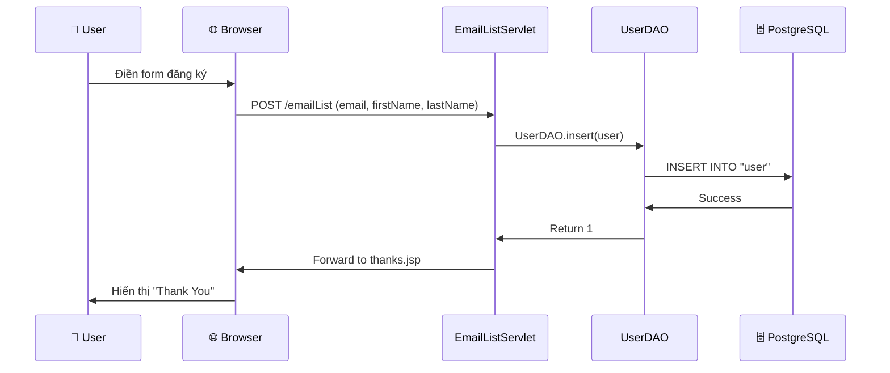
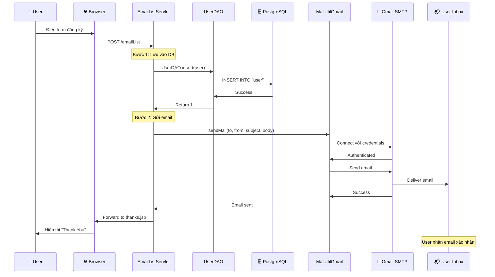

# Giải thích Chức năng Gửi Email - SQLGatewayApp

## 🎯 Tổng quan

Chức năng gửi email đã được thêm vào project để **tự động gửi email xác nhận** cho user sau khi họ đăng ký thành công vào email list.

---

## 📊 Luồng hoạt động hoàn chỉnh

### Trước khi có Email (Cũ):



**Vấn đề**: User không nhận được email xác nhận!

---

### Sau khi có Email (Mới):



**Cải thiện**: User nhận email xác nhận ngay sau khi đăng ký! ✅

---

## 🏗️ Kiến trúc Email System

### Các thành phần chính:

```
┌─────────────────────────────────────────────────────────┐
│                    Email System                          │
├─────────────────────────────────────────────────────────┤
│                                                           │
│  ┌──────────────┐      ┌──────────────┐                │
│  │ MailUtilLocal│      │ MailUtilGmail│                │
│  │              │      │              │                │
│  │ - localhost  │      │ - Gmail SMTP │                │
│  │ - Port 25    │      │ - Port 465   │                │
│  │ - No Auth    │      │ - With Auth  │                │
│  └──────────────┘      └──────────────┘                │
│         ▲                      ▲                         │
│         │                      │                         │
│         └──────────┬───────────┘                         │
│                    │                                     │
│         ┌──────────▼──────────┐                         │
│         │  EmailListServlet   │                         │
│         │                     │                         │
│         │  - Gọi sendMail()   │                         │
│         │  - Handle errors    │                         │
│         └─────────────────────┘                         │
│                                                           │
└─────────────────────────────────────────────────────────┘
```

---

## 📦 Các file đã thêm/sửa

### 1. **pom.xml** - Thêm JavaMail Dependency

**Vị trí**: `pom.xml`

**Thay đổi**:
```xml
<!-- JavaMail API -->
<dependency>
    <groupId>com.sun.mail</groupId>
    <artifactId>javax.mail</artifactId>
    <version>1.6.2</version>
</dependency>
```

**Giải thích**:
- Thêm thư viện JavaMail API để có thể gửi email
- Version 1.6.2 là version ổn định
- Dependency này sẽ được Maven tự động tải về

---

### 2. **MailUtilLocal.java** - Gửi email qua Local SMTP

**Vị trí**: `src/main/java/murach/email/MailUtilLocal.java`

**Mục đích**: Gửi email qua SMTP server chạy trên localhost (cho development/testing)

**Code chính**:
```java
public static void sendMail(String to, String from, 
                            String subject, String body, 
                            boolean bodyIsHTML) {
    // 1. Get mail session
    Properties props = new Properties();
    props.put("mail.smtp.host", "localhost");
    props.put("mail.smtp.port", 25);
    Session session = Session.getDefaultInstance(props);
    
    // 2. Create message
    Message message = new MimeMessage(session);
    message.setSubject(subject);
    message.setText(body);
    
    // 3. Address message
    message.setFrom(new InternetAddress(from));
    message.setRecipient(Message.RecipientType.TO, 
                        new InternetAddress(to));
    
    // 4. Send message
    Transport.send(message);
}
```

**Giải thích từng bước**:

#### Bước 1: Get mail session (Lấy phiên mail)
```java
Properties props = new Properties();
props.put("mail.smtp.host", "localhost");
props.put("mail.smtp.port", 25);
Session session = Session.getDefaultInstance(props);
```

- **Properties**: Lưu trữ cấu hình SMTP
- **mail.smtp.host**: Địa chỉ SMTP server (localhost = máy tính của bạn)
- **mail.smtp.port**: Cổng SMTP (25 là cổng mặc định)
- **Session**: Đại diện cho phiên kết nối email

#### Bước 2: Create message (Tạo tin nhắn)
```java
Message message = new MimeMessage(session);
message.setSubject("Welcome!");
message.setText("Thank you for joining!");
```

- **MimeMessage**: Đại diện cho email message
- **setSubject()**: Đặt tiêu đề email
- **setText()**: Đặt nội dung email (plain text)

#### Bước 3: Address message (Đặt địa chỉ)
```java
message.setFrom(new InternetAddress("noreply@app.com"));
message.setRecipient(Message.RecipientType.TO, 
                    new InternetAddress("user@example.com"));
```

- **InternetAddress**: Đại diện cho địa chỉ email
- **setFrom()**: Đặt người gửi
- **setRecipient()**: Đặt người nhận
- **RecipientType.TO**: Loại người nhận (TO, CC, BCC)

#### Bước 4: Send message (Gửi tin nhắn)
```java
Transport.send(message);
```

- **Transport**: Class để gửi email
- **send()**: Phương thức tĩnh gửi email (không cần authentication)

---

### 3. **MailUtilGmail.java** - Gửi email qua Gmail SMTP

**Vị trí**: `src/main/java/murach/email/MailUtilGmail.java`

**Mục đích**: Gửi email qua Gmail SMTP server (cho production)

**Code chính**:
```java
public static void sendMail(String to, String from, 
                            String subject, String body, 
                            boolean bodyIsHTML) {
    // Gmail credentials - Đọc từ Environment Variables
    final String username = System.getenv("GMAIL_USERNAME") != null 
                          ? System.getenv("GMAIL_USERNAME") 
                          : "tanloc01293@gmail.com";
    final String password = System.getenv("GMAIL_PASSWORD") != null 
                          ? System.getenv("GMAIL_PASSWORD") 
                          : "ifzv vjpc gspu xglp";
    
    // 1. Get mail session with authentication
    Properties props = new Properties();
    props.put("mail.transport.protocol", "smtps");
    props.put("mail.smtps.host", "smtp.gmail.com");
    props.put("mail.smtps.port", 465);
    props.put("mail.smtps.auth", "true");
    props.put("mail.smtps.quitwait", "false");
    
    Session session = Session.getDefaultInstance(props);
    
    // 2-3. Create and address message
    Message message = new MimeMessage(session);
    message.setSubject(subject);
    message.setText(body);
    message.setFrom(new InternetAddress(from));
    message.setRecipient(Message.RecipientType.TO, 
                        new InternetAddress(to));
    
    // 4. Send with authentication
    Transport transport = session.getTransport();
    transport.connect(username, password);
    transport.sendMessage(message, message.getAllRecipients());
    transport.close();
}
```

**Khác biệt so với Local SMTP**:

| Đặc điểm | Local SMTP | Gmail SMTP |
|----------|------------|------------|
| **Protocol** | `smtp` | `smtps` (secure) |
| **Host** | `localhost` | `smtp.gmail.com` |
| **Port** | `25` | `465` (SSL) |
| **Authentication** | Không cần | **Cần** username + password |
| **Gửi email** | `Transport.send()` | `transport.connect()` + `sendMessage()` |

**Giải thích Environment Variables**:

```java
final String username = System.getenv("GMAIL_USERNAME") != null 
                      ? System.getenv("GMAIL_USERNAME") 
                      : "tanloc01293@gmail.com";
```

- **System.getenv("GMAIL_USERNAME")**: Đọc biến môi trường
- Nếu có biến môi trường → dùng giá trị đó (production)
- Nếu không có → dùng hardcoded value (local development)

**Tại sao cần Environment Variables?**
- ✅ **Bảo mật**: Không commit credentials vào Git
- ✅ **Linh hoạt**: Dễ thay đổi credentials trên server
- ✅ **Best practice**: Theo chuẩn 12-factor app

---

### 4. **EmailListServlet.java** - Tích hợp gửi email

**Vị trí**: `src/main/java/murach/email/EmailListServlet.java`

**Thay đổi**: Thêm logic gửi email sau khi insert user

**Code đã thêm**:
```java
else {
    message = "";
    url = "/thanks.jsp";
    UserDAO.insert(user);  // ← Insert vào database
    
    // Send confirmation email ← MỚI THÊM
    try {
        String to = email;
        String from = "noreply@sqlgatewayapp.com";
        String subject = "Welcome to our Email List";
        String body = "Dear " + firstName + ",\n\n" +
                    "Thank you for joining our email list!\n\n" +
                    "Your information:\n" +
                    "Name: " + firstName + " " + lastName + "\n" +
                    "Email: " + email + "\n\n" +
                    "Best regards,\n" +
                    "SQL Gateway App Team";
        boolean isBodyHTML = false;
        
        // Sử dụng Gmail SMTP
        MailUtilGmail.sendMail(to, from, subject, body, isBodyHTML);
        
        System.out.println("Confirmation email sent to: " + email);
    } catch (Exception e) {
        System.err.println("Error sending email: " + e.getMessage());
        e.printStackTrace();
        // Không throw exception - vẫn cho phép user đăng ký
    }
}
```

**Giải thích từng phần**:

#### 1. Chuẩn bị thông tin email:
```java
String to = email;  // Email người nhận (user vừa đăng ký)
String from = "noreply@sqlgatewayapp.com";  // Email người gửi
String subject = "Welcome to our Email List";  // Tiêu đề
```

#### 2. Tạo nội dung email:
```java
String body = "Dear " + firstName + ",\n\n" +
            "Thank you for joining our email list!\n\n" +
            "Your information:\n" +
            "Name: " + firstName + " " + lastName + "\n" +
            "Email: " + email + "\n\n" +
            "Best regards,\n" +
            "SQL Gateway App Team";
```

- Sử dụng **string concatenation** để tạo nội dung động
- Bao gồm thông tin user (firstName, lastName, email)
- Format: Plain text với `\n` để xuống dòng

#### 3. Gửi email:
```java
MailUtilGmail.sendMail(to, from, subject, body, isBodyHTML);
```

- Gọi method tĩnh `sendMail()` của `MailUtilGmail`
- Truyền 5 tham số: to, from, subject, body, isBodyHTML

#### 4. Error handling:
```java
try {
    // Gửi email
} catch (Exception e) {
    System.err.println("Error sending email: " + e.getMessage());
    e.printStackTrace();
    // KHÔNG throw exception
}
```

**Tại sao không throw exception?**
- User đã đăng ký thành công vào database
- Nếu email lỗi, không nên fail toàn bộ request
- **Graceful degradation**: Chức năng chính vẫn hoạt động dù email lỗi

---

### 5. **TestEmail.java** - Test class

**Vị trí**: `src/main/java/murach/test/TestEmail.java`

**Mục đích**: Test chức năng gửi email trước khi deploy

**Code chính**:
```java
public static void main(String[] args) {
    // testGmailSMTP();  // Uncomment để test
}

private static void testGmailSMTP() {
    try {
        String to = "tanloc251095@gmail.com";
        String from = "tanloc01293@gmail.com";
        String subject = "Test Email from SQLGatewayApp";
        String body = "This is a test email...";
        boolean isBodyHTML = false;
        
        MailUtilGmail.sendMail(to, from, subject, body, isBodyHTML);
        
        System.out.println("✅ Email sent successfully!");
    } catch (Exception e) {
        System.err.println("❌ Error: " + e.getMessage());
        e.printStackTrace();
    }
}
```

**Cách sử dụng**:
1. Uncomment dòng `testGmailSMTP();`
2. Run file (Shift + F6)
3. Kiểm tra console output
4. Kiểm tra inbox Gmail

---

## 🔄 Luồng code chi tiết

### Khi user đăng ký:

```
1. User điền form:
   - First Name: John
   - Last Name: Doe
   - Email: john@example.com

2. Browser gửi POST request:
   POST /emailList
   action=add
   firstName=John
   lastName=Doe
   email=john@example.com

3. EmailListServlet.doPost() nhận request:
   ↓
   String firstName = request.getParameter("firstName");  // "John"
   String lastName = request.getParameter("lastName");    // "Doe"
   String email = request.getParameter("email");          // "john@example.com"

4. Tạo User object:
   ↓
   User user = new User("John", "Doe", "john@example.com");

5. Kiểm tra email tồn tại:
   ↓
   if (UserDAO.emailExists("john@example.com")) {
       // Email đã tồn tại → Hiển thị lỗi
   } else {
       // Email chưa tồn tại → Tiếp tục
   }

6. Insert vào database:
   ↓
   UserDAO.insert(user);
   // SQL: INSERT INTO "user" (email, firstname, lastname) 
   //      VALUES ('john@example.com', 'John', 'Doe')

7. Gửi email xác nhận:
   ↓
   MailUtilGmail.sendMail(
       "john@example.com",           // to
       "noreply@sqlgatewayapp.com",  // from
       "Welcome to our Email List",   // subject
       "Dear John,\n\nThank you...",  // body
       false                          // isBodyHTML
   );

8. MailUtilGmail xử lý:
   ↓
   a. Đọc credentials từ Environment Variables
   b. Tạo Properties với Gmail SMTP config
   c. Tạo Session
   d. Tạo MimeMessage
   e. Đặt subject, body, from, to
   f. Connect đến Gmail SMTP với username/password
   g. Gửi email
   h. Đóng connection

9. Gmail SMTP server:
   ↓
   a. Nhận email từ app
   b. Verify credentials
   c. Gửi email đến john@example.com
   d. Return success

10. User nhận email:
    ↓
    Subject: Welcome to our Email List
    From: noreply@sqlgatewayapp.com
    To: john@example.com
    
    Dear John,
    
    Thank you for joining our email list!
    
    Your information:
    Name: John Doe
    Email: john@example.com
    
    Best regards,
    SQL Gateway App Team

11. Servlet forward đến thanks.jsp:
    ↓
    User thấy trang "Thank You"
```

---

## 🎯 Các khái niệm quan trọng

### 1. **SMTP (Simple Mail Transfer Protocol)**

**Là gì?**: Giao thức để gửi email từ client → server hoặc server → server

**Ports**:
- **25**: SMTP không mã hóa (thường bị ISP chặn)
- **465**: SMTPS (SMTP over SSL)
- **587**: SMTP with STARTTLS

**Trong code**:
```java
props.put("mail.transport.protocol", "smtps");  // Dùng SMTPS
props.put("mail.smtps.host", "smtp.gmail.com"); // Gmail SMTP server
props.put("mail.smtps.port", 465);              // Port SSL
```

---

### 2. **JavaMail API**

**Là gì?**: API của Java để gửi/nhận email

**Các class chính**:

| Class | Mô tả | Ví dụ |
|-------|-------|-------|
| `Properties` | Lưu cấu hình SMTP | `props.put("mail.smtp.host", "localhost")` |
| `Session` | Phiên kết nối email | `Session.getDefaultInstance(props)` |
| `MimeMessage` | Email message | `new MimeMessage(session)` |
| `InternetAddress` | Địa chỉ email | `new InternetAddress("user@example.com")` |
| `Transport` | Gửi email | `Transport.send(message)` |

---

### 3. **Authentication (Xác thực)**

**Local SMTP** (không cần auth):
```java
Transport.send(message);  // Gửi trực tiếp
```

**Gmail SMTP** (cần auth):
```java
Transport transport = session.getTransport();
transport.connect(username, password);  // Đăng nhập
transport.sendMessage(message, recipients);
transport.close();
```

**Tại sao Gmail cần auth?**
- Ngăn spam
- Bảo mật tài khoản
- Theo dõi ai đang gửi email

---

### 4. **Environment Variables**

**Là gì?**: Biến được lưu trong hệ thống, không phải trong code

**Tại sao dùng?**
- ✅ Bảo mật: Không commit credentials vào Git
- ✅ Linh hoạt: Dễ thay đổi giữa môi trường (dev, staging, prod)
- ✅ Best practice: Theo chuẩn 12-factor app

**Trong code**:
```java
String username = System.getenv("GMAIL_USERNAME");
// Đọc từ biến môi trường GMAIL_USERNAME
```

**Trên Render**:
```
Environment Variables:
GMAIL_USERNAME = tanloc01293@gmail.com
GMAIL_PASSWORD = ifzv vjpc gspu xglp
```

---

## 📊 So sánh trước và sau

### Trước khi có Email:

```
User đăng ký → Lưu vào DB → Hiển thị "Thank You"
```

**Vấn đề**:
- ❌ User không biết đã đăng ký thành công
- ❌ Không có proof (bằng chứng)
- ❌ User có thể quên đã đăng ký

---

### Sau khi có Email:

```
User đăng ký → Lưu vào DB → Gửi email → Hiển thị "Thank You"
                                ↓
                         User nhận email xác nhận
```

**Cải thiện**:
- ✅ User nhận email xác nhận ngay lập tức
- ✅ Có proof trong inbox
- ✅ Professional hơn
- ✅ Tăng trust (lòng tin)

---

## 🎓 Tóm tắt

### Đã thêm:

1. **JavaMail dependency** - Thư viện gửi email
2. **MailUtilLocal** - Gửi qua local SMTP
3. **MailUtilGmail** - Gửi qua Gmail SMTP
4. **Email logic trong Servlet** - Tự động gửi sau khi đăng ký
5. **TestEmail** - Test class
6. **Environment Variables** - Bảo mật credentials

### Luồng hoạt động:

```
User đăng ký
    ↓
Servlet nhận request
    ↓
Insert vào database
    ↓
Gửi email qua Gmail SMTP
    ↓
User nhận email xác nhận
    ↓
Hiển thị trang "Thank You"
```

### Công nghệ sử dụng:

- **JavaMail API** - Gửi email
- **SMTP/SMTPS** - Giao thức email
- **Gmail SMTP** - Server gửi email
- **Environment Variables** - Bảo mật credentials

---

**Bây giờ ứng dụng của bạn đã có chức năng gửi email tự động! 🎉**
