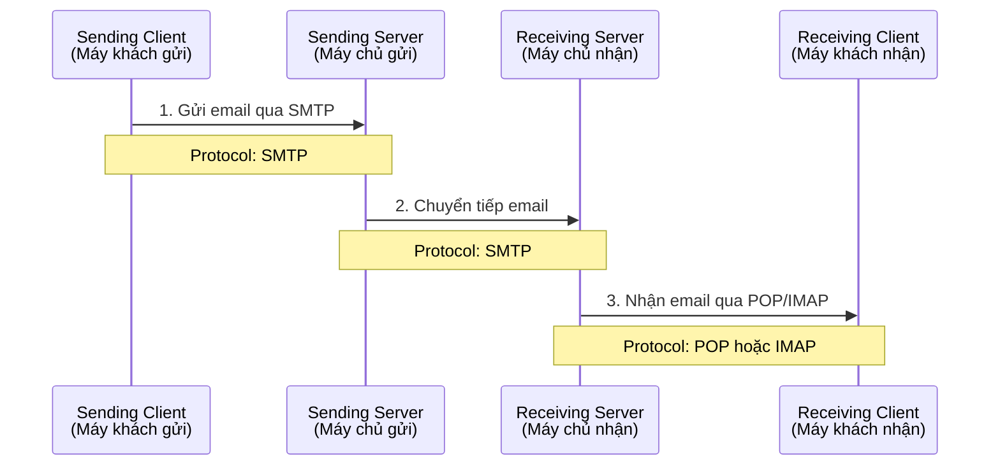

# Chương 14: Hướng dẫn sử dụng JavaMail API

## 📋 Mục lục

1. [Giới thiệu và Mục tiêu](#giới-thiệu-và-mục-tiêu)
2. [Cơ chế hoạt động của Email](#cơ-chế-hoạt-động-của-email)
3. [JavaMail API và Cài đặt](#javamail-api-và-cài-đặt)
4. [Các gói Java cơ bản](#các-gói-java-cơ-bản)
5. [Thiết lập Phiên Email (Session)](#thiết-lập-phiên-email-session)
6. [Tạo và Định địa chỉ Tin nhắn](#tạo-và-định-địa-chỉ-tin-nhắn)
7. [Gửi Tin nhắn (Transport)](#gửi-tin-nhắn-transport)
8. [Ví dụ thực tế](#ví-dụ-thực-tế)

---

## Giới thiệu và Mục tiêu

### 🎯 Mục tiêu Ứng dụng (Applied)

Phát triển các servlet có khả năng **gửi tin nhắn email** đến người dùng của ứng dụng.

### 📚 Mục tiêu Kiến thức (Knowledge)

Mô tả cách một tin nhắn email được gửi từ một máy khách (client) này sang máy khách khác, dựa trên các giao thức:
- **SMTP** (Simple Mail Transfer Protocol)
- **POP** (Post Office Protocol)  
- **MIME** (Multipurpose Internet Mail Extension)

---

## Cơ chế hoạt động của Email

### 📧 Sơ đồ hoạt động của Email



### Quá trình gửi email gồm 4 bước:

1. **Máy khách gửi (Sending client)**: 
   - Phần mềm máy khách (ví dụ: Outlook, Gmail web)
   - Gửi tin nhắn tới Máy chủ gửi qua **SMTP**

2. **Máy chủ gửi (Sending server)**:
   - Phần mềm máy chủ mail (ví dụ: Gmail SMTP server)
   - Chuyển tiếp tin nhắn đến Máy chủ nhận

3. **Máy chủ nhận (Receiving server)**:
   - Chứa phần mềm máy chủ mail
   - Lưu trữ email cho người nhận

4. **Máy khách nhận (Receiving client)**:
   - Phần mềm máy khách nhận
   - Nhận tin nhắn từ Máy chủ nhận qua **POP** hoặc **IMAP**

---

### 🔌 Ba giao thức chính

#### 1. SMTP (Simple Mail Transfer Protocol)

**Mục đích**: Gửi email từ máy chủ mail này sang máy chủ mail khác

**Đặc điểm**:
- Port mặc định: **25** (không mã hóa)
- Port SSL/TLS: **465** (SMTPS - mã hóa)
- Port STARTTLS: **587** (mã hóa)

**Sử dụng**:
- Gửi email từ client → server
- Chuyển tiếp email giữa các server

**Ví dụ**:
```
Client → Gmail SMTP Server (smtp.gmail.com:465)
```

---

#### 2. POP (Post Office Protocol)

**Mục đích**: Tải email từ máy chủ mail về máy khách

**Đặc điểm**:
- Port mặc định: **110**
- Port SSL: **995**
- Tải email về và **xóa khỏi server** (mặc định)

**Ưu điểm**:
- Đơn giản, nhanh
- Tiết kiệm dung lượng server

**Nhược điểm**:
- Email chỉ ở một thiết bị
- Không đồng bộ giữa các thiết bị

---

#### 3. IMAP (Internet Message Access Protocol)

**Mục đích**: Đọc email trực tiếp trên máy chủ mail

**Đặc điểm**:
- Port mặc định: **143**
- Port SSL: **993**
- Email **vẫn ở trên server**

**Ưu điểm**:
- Đồng bộ giữa nhiều thiết bị
- Quản lý folder, flag, search trên server

**Nhược điểm**:
- Tốn dung lượng server
- Cần kết nối Internet để đọc

---

### 📎 Giao thức MIME

**MIME (Multipurpose Internet Mail Extension)**

**Mục đích**: Chỉ định loại nội dung có thể được gửi dưới dạng tin nhắn hoặc tệp đính kèm

**Các MIME types phổ biến**:

| MIME Type | Mô tả |
|-----------|-------|
| `text/plain` | Văn bản thuần túy |
| `text/html` | Tài liệu HTML |
| `image/jpeg` | Hình ảnh JPEG |
| `image/png` | Hình ảnh PNG |
| `application/pdf` | File PDF |
| `application/zip` | File nén ZIP |

**Ví dụ trong email**:
```java
message.setContent("<h1>Hello</h1>", "text/html");  // HTML email
message.setText("Hello");                            // Plain text email
```

---

## JavaMail API và Cài đặt

### 📦 Giới thiệu về JavaMail API

**JavaMail API** là một API cấp cao (high-level API) cho phép bạn:
- Sử dụng giao thức mail để giao tiếp với máy chủ mail
- Gửi và nhận email
- Quản lý email (đọc, xóa, di chuyển)

**Đặc điểm**:
- API chuẩn của Java
- Hỗ trợ SMTP, POP, IMAP
- Phụ thuộc vào JavaBeans Activation Framework (JAF)

**Lưu ý**:
- JAF đã được bao gồm trong **Java SE 6 trở lên**
- Chỉ cần thêm JavaMail dependency

---

### 🔧 Cách cài đặt JavaMail API

#### Bước 1: Thêm dependency vào pom.xml

```xml
<!-- JavaMail API -->
<dependency>
    <groupId>com.sun.mail</groupId>
    <artifactId>javax.mail</artifactId>
    <version>1.6.2</version>
</dependency>
```

#### Bước 2: Build project

```bash
mvn clean install
```

Hoặc trong NetBeans: **Clean and Build** (Shift + F11)

#### Bước 3: Verify dependency

Kiểm tra trong **Dependencies** của project, bạn sẽ thấy:
- `javax.mail-1.6.2.jar`

---

### 📚 Tài liệu JavaMail API

Để xem tài liệu chi tiết:
1. Tìm kiếm Google: **"javax.mail documentation"**
2. Hoặc truy cập: https://javaee.github.io/javamail/

---

## Các gói Java cơ bản

### 📦 Ba gói (packages) để gửi email

#### 1. `java.util`

**Chứa**: Lớp `Properties`

**Mục đích**: Thiết lập các thuộc tính cho phiên email (email session)

**Ví dụ**:
```java
Properties props = new Properties();
props.put("mail.smtp.host", "localhost");
props.put("mail.smtp.port", 25);
```

---

#### 2. `javax.mail`

**Chứa**: Các lớp cốt lõi của JavaMail

| Class | Mô tả |
|-------|-------|
| `Session` | Quản lý phiên email |
| `Message` | Đại diện cho email message |
| `Address` | Địa chỉ email |
| `Transport` | Gửi email |
| `MessagingException` | Exception khi có lỗi |

---

#### 3. `javax.mail.internet`

**Chứa**: Các lớp cho email qua Internet

| Class | Mô tả |
|-------|-------|
| `MimeMessage` | Email message theo chuẩn MIME |
| `InternetAddress` | Địa chỉ email Internet |

---

### 💻 Mã cơ bản để gửi email

```java
import java.util.Properties;
import javax.mail.*;
import javax.mail.internet.*;

public class SendEmailExample {
    public static void main(String[] args) throws MessagingException {
        
        // 1. Get a mail session (Lấy phiên mail)
        Properties props = new Properties();
        props.put("mail.smtp.host", "localhost");
        Session session = Session.getDefaultInstance(props);
        
        // 2. Create a message (Tạo tin nhắn)
        Message message = new MimeMessage(session);
        message.setSubject("Test Email");
        message.setText("This is a test email");
        
        // 3. Address the message (Đặt địa chỉ)
        Address fromAddress = new InternetAddress("from@example.com");
        Address toAddress = new InternetAddress("to@example.com");
        message.setFrom(fromAddress);
        message.setRecipient(Message.RecipientType.TO, toAddress);
        
        // 4. Send the message (Gửi tin nhắn)
        Transport.send(message);
        
        System.out.println("Email sent successfully!");
    }
}
```

---

## Thiết lập Phiên Email (Session)

### ⚙️ Các thuộc tính có thể thiết lập

| Thuộc tính | Mô tả | Giá trị ví dụ |
|------------|-------|---------------|
| `mail.transport.protocol` | Giao thức sử dụng | `smtp` hoặc `smtps` |
| `mail.smtp.host` | Máy chủ SMTP | `localhost` hoặc `smtp.gmail.com` |
| `mail.smtp.port` | Cổng SMTP | `25`, `465`, `587` |
| `mail.smtp.auth` | Yêu cầu xác thực | `true` hoặc `false` |
| `mail.smtp.quitwait` | Chờ quit command | `false` (tránh SSLException) |

---

### 🏠 Cách lấy phiên mail cho Local SMTP Server

#### Cách đơn giản:

```java
Properties props = new Properties();
props.put("mail.smtp.host", "localhost");
Session session = Session.getDefaultInstance(props);
```

#### Cách chi tiết:

```java
Properties props = new Properties();
props.put("mail.transport.protocol", "smtp");
props.put("mail.smtp.host", "localhost");
props.put("mail.smtp.port", 25);

Session session = Session.getDefaultInstance(props);
session.setDebug(true);  // Bật debug mode
```

---

### 🌐 Cách lấy phiên mail cho Gmail SMTP Server

```java
Properties props = new Properties();
props.put("mail.transport.protocol", "smtps");
props.put("mail.smtps.host", "smtp.gmail.com");
props.put("mail.smtps.port", 465);
props.put("mail.smtps.auth", "true");
props.put("mail.smtps.quitwait", "false");  // Tránh SSLException

Session session = Session.getDefaultInstance(props);
session.setDebug(true);
```

---

### 📘 Lớp Session

**Đối tượng Session** chứa thông tin về phiên mail:
- Giao thức (SMTP, SMTPS)
- Host (localhost, smtp.gmail.com)
- Port (25, 465, 587)
- Các thuộc tính khác

**Phương thức quan trọng**:

```java
// Lấy Session mặc định
Session session = Session.getDefaultInstance(props);

// Bật debug mode
session.setDebug(true);

// Lấy Transport object
Transport transport = session.getTransport();
```

**Lưu ý**:
- Nếu thay đổi thuộc tính Session, phải **khởi động lại Tomcat**
- Nếu ứng dụng chạy cùng máy với SMTP server, dùng `localhost`

---

## Tạo và Định địa chỉ Tin nhắn

### ✉️ Cách tạo tin nhắn

#### Tạo Message object:

```java
Message message = new MimeMessage(session);
```

#### Đặt tiêu đề:

```java
message.setSubject("Order Confirmation");
```

#### Đặt nội dung văn bản thuần túy:

```java
message.setText("Thanks for your order!");
```

#### Đặt nội dung HTML:

```java
message.setContent("<h1>Thanks for your order!</h1>", "text/html");
```

---

### 📘 Lớp MimeMessage

**MimeMessage** (trong gói `javax.mail.internet`) được sử dụng để tạo tin nhắn email.

**Constructor**:
```java
MimeMessage(Session session)
```

**Phương thức quan trọng**:

| Phương thức | Mô tả |
|-------------|-------|
| `setSubject(String)` | Đặt tiêu đề email |
| `setText(String)` | Đặt nội dung plain text |
| `setContent(String, String)` | Đặt nội dung với MIME type |
| `setFrom(Address)` | Đặt địa chỉ người gửi |
| `setRecipient(...)` | Đặt địa chỉ người nhận |

**Ví dụ**:
```java
Message message = new MimeMessage(session);
message.setSubject("Welcome!");
message.setText("Thank you for joining!");
```

---

### 📮 Cách thiết lập địa chỉ

#### Địa chỉ From (Người gửi):

```java
Address fromAddress = new InternetAddress("noreply@example.com");
message.setFrom(fromAddress);
```

#### Địa chỉ To (Người nhận):

```java
Address toAddress = new InternetAddress("user@example.com");
message.setRecipient(Message.RecipientType.TO, toAddress);
```

#### Địa chỉ CC (Carbon Copy):

```java
Address ccAddress = new InternetAddress("manager@example.com");
message.setRecipient(Message.RecipientType.CC, ccAddress);
```

#### Địa chỉ BCC (Blind Carbon Copy):

```java
Address bccAddress = new InternetAddress("admin@example.com");
message.setRecipient(Message.RecipientType.BCC, bccAddress);
```

---

### 👤 Cách thêm tên vào địa chỉ

```java
// Bao gồm tên
Address address = new InternetAddress("user@example.com", "John Doe");
message.setFrom(address);
```

Email sẽ hiển thị: **John Doe <user@example.com>**

---

### 👥 Gửi đến nhiều người nhận

```java
// Tạo mảng địa chỉ
Address[] mailList = new Address[3];
mailList[0] = new InternetAddress("user1@example.com");
mailList[1] = new InternetAddress("user2@example.com");
mailList[2] = new InternetAddress("user3@example.com");

// Đặt nhiều người nhận
message.setRecipients(Message.RecipientType.TO, mailList);
```

---

### ➕ Thêm người nhận vào tin nhắn

```java
// Thêm người nhận (không ghi đè)
Address newRecipient = new InternetAddress("user4@example.com");
message.addRecipient(Message.RecipientType.TO, newRecipient);
```

---

### 📘 Lớp InternetAddress

**InternetAddress** được sử dụng để định nghĩa địa chỉ email.

**Constructors**:
```java
InternetAddress(String email)
InternetAddress(String email, String name)
```

**Ví dụ**:
```java
// Chỉ email
Address addr1 = new InternetAddress("john@example.com");

// Email + tên
Address addr2 = new InternetAddress("john@example.com", "John Doe");
```

---

## Gửi Tin nhắn (Transport)

### 📤 Cách gửi tin nhắn

#### Khi KHÔNG yêu cầu xác thực (Local SMTP):

```java
Transport.send(message);
```

#### Khi YÊU CẦU xác thực (Gmail SMTP):

```java
// 1. Lấy Transport object
Transport transport = session.getTransport();

// 2. Kết nối với username và password
transport.connect("johnsmith@gmail.com", "app-password");

// 3. Gửi tin nhắn
transport.sendMessage(message, message.getAllRecipients());

// 4. Đóng kết nối
transport.close();
```

---

### 📘 Lớp Transport

**Transport** được sử dụng để gửi email.

**Phương thức tĩnh** (không cần xác thực):
```java
static void send(Message message)
```

**Phương thức instance** (cần xác thực):
```java
void connect(String username, String password)
void sendMessage(Message message, Address[] addresses)
void close()
```

**Exception**:
- `SendFailedException`: Khi không gửi được tin nhắn

---

## Ví dụ thực tế

### 📝 Ví dụ 1: Gửi email qua Local SMTP

```java
package murach.email;

import java.util.Properties;
import javax.mail.*;
import javax.mail.internet.*;

public class MailUtilLocal {
    
    public static void sendMail(String to, String from, 
                                String subject, String body, 
                                boolean bodyIsHTML) 
            throws MessagingException {
        
        // 1. Get a mail session
        Properties props = new Properties();
        props.put("mail.transport.protocol", "smtp");
        props.put("mail.smtp.host", "localhost");
        props.put("mail.smtp.port", 25);
        
        Session session = Session.getDefaultInstance(props);
        session.setDebug(true);
        
        // 2. Create a message
        Message message = new MimeMessage(session);
        message.setSubject(subject);
        
        if (bodyIsHTML) {
            message.setContent(body, "text/html");
        } else {
            message.setText(body);
        }
        
        // 3. Address the message
        Address fromAddress = new InternetAddress(from);
        Address toAddress = new InternetAddress(to);
        
        message.setFrom(fromAddress);
        message.setRecipient(Message.RecipientType.TO, toAddress);
        
        // 4. Send the message
        Transport.send(message);
    }
}
```

**Sử dụng**:
```java
MailUtilLocal.sendMail(
    "user@example.com",           // to
    "noreply@myapp.com",          // from
    "Welcome",                     // subject
    "Thanks for joining!",         // body
    false                          // bodyIsHTML
);
```

---

### 📝 Ví dụ 2: Gửi email qua Gmail SMTP

```java
package murach.email;

import java.util.Properties;
import javax.mail.*;
import javax.mail.internet.*;

public class MailUtilGmail {
    
    public static void sendMail(String to, String from, 
                                String subject, String body, 
                                boolean bodyIsHTML) 
            throws MessagingException {
        
        // Gmail credentials
        final String username = "your-email@gmail.com";
        final String password = "your-app-password";
        
        // 1. Get a mail session
        Properties props = new Properties();
        props.put("mail.transport.protocol", "smtps");
        props.put("mail.smtps.host", "smtp.gmail.com");
        props.put("mail.smtps.port", 465);
        props.put("mail.smtps.auth", "true");
        props.put("mail.smtps.quitwait", "false");
        
        Session session = Session.getDefaultInstance(props);
        session.setDebug(true);
        
        // 2. Create a message
        Message message = new MimeMessage(session);
        message.setSubject(subject);
        
        if (bodyIsHTML) {
            message.setContent(body, "text/html");
        } else {
            message.setText(body);
        }
        
        // 3. Address the message
        Address fromAddress = new InternetAddress(from);
        Address toAddress = new InternetAddress(to);
        
        message.setFrom(fromAddress);
        message.setRecipient(Message.RecipientType.TO, toAddress);
        
        // 4. Send the message (with authentication)
        Transport transport = session.getTransport();
        transport.connect(username, password);
        transport.sendMessage(message, message.getAllRecipients());
        transport.close();
    }
}
```

**Sử dụng**:
```java
MailUtilGmail.sendMail(
    "user@example.com",           // to
    "johnsmith@gmail.com",        // from
    "Welcome",                     // subject
    "Thanks for joining!",         // body
    false                          // bodyIsHTML
);
```

---

### 📝 Ví dụ 3: Servlet gửi email

```java
package murach.email;

import java.io.*;
import jakarta.servlet.*;
import jakarta.servlet.http.*;
import murach.business.User;
import murach.data.UserDAO;

public class EmailListServlet extends HttpServlet {
    
    @Override
    protected void doPost(HttpServletRequest request,
                         HttpServletResponse response)
            throws ServletException, IOException {
        
        String action = request.getParameter("action");
        
        if (action.equals("add")) {
            // Get parameters
            String firstName = request.getParameter("firstName");
            String lastName = request.getParameter("lastName");
            String email = request.getParameter("email");
            
            // Create User object
            User user = new User(firstName, lastName, email);
            
            // Insert into database
            UserDAO.insert(user);
            
            // Send confirmation email
            try {
                String to = email;
                String from = "noreply@sqlgatewayapp.com";
                String subject = "Welcome to our Email List";
                String body = "Dear " + firstName + ",\n\n" +
                            "Thank you for joining our email list!\n\n" +
                            "Best regards,\n" +
                            "SQL Gateway App Team";
                boolean isBodyHTML = false;
                
                MailUtilGmail.sendMail(to, from, subject, body, isBodyHTML);
                
                System.out.println("Email sent to: " + email);
            } catch (Exception e) {
                System.err.println("Error sending email: " + e.getMessage());
                e.printStackTrace();
            }
            
            // Forward to thanks page
            request.setAttribute("user", user);
            getServletContext()
                .getRequestDispatcher("/thanks.jsp")
                .forward(request, response);
        }
    }
}
```

---

## 🎓 Tóm tắt

### Các bước gửi email:

1. **Get a mail session**: Tạo Properties và Session
2. **Create a message**: Tạo MimeMessage, đặt subject và body
3. **Address the message**: Đặt From và To addresses
4. **Send the message**: Sử dụng Transport.send() hoặc transport.sendMessage()

### Giao thức:

- **SMTP**: Gửi email (port 25, 465, 587)
- **POP**: Nhận email, xóa khỏi server (port 110, 995)
- **IMAP**: Đọc email trên server (port 143, 993)
- **MIME**: Định nghĩa loại nội dung

### Classes quan trọng:

- `Properties`: Cấu hình session
- `Session`: Quản lý phiên email
- `MimeMessage`: Đại diện email
- `InternetAddress`: Địa chỉ email
- `Transport`: Gửi email

---

## 📚 Tài liệu tham khảo

- [JavaMail API Documentation](https://javaee.github.io/javamail/)
- [Gmail SMTP Settings](https://support.google.com/mail/answer/7126229)
- [SMTP Protocol RFC](https://tools.ietf.org/html/rfc5321)

---

**Chúc bạn học tốt! 📧**
